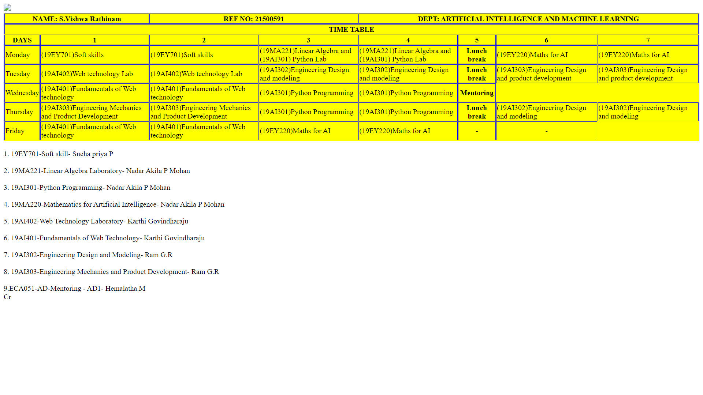

# Experiment_Time_Table

## AIM
To Write a html webpage page to display your timetable.

# ALGORITHM
### STEP 1
create a simple table using table tag
### STEP 2
Add header row using th tag
### STEP 3
Add your timetable
### STEP 4
Execute the program

# CODE
<<<<<<< HEAD
```
<!DOCTYPE html>
<html>

<head>
    <title>TIME TABLE</title>
</head>

<body>
    <table border="1" cellspacing="1" bordercolor="blue" bgcolor="yellow">
        
        <tr>
            <th colspan="2"> NAME: S.Vishwa Rathinam
            <th colspan="2"> REF NO: 21500591
            <th colspan="6"> DEPT: ARTIFICIAL INTELLIGENCE AND MACHINE LEARNING</th>
        </tr>
        <tr>
            <th colspan="8">TIME TABLE</th>
        </tr>

        <tr>
=======
~
<!DOCTYPE html>
<html>
<center>
   <head>
    <title>🗓️TIME TABLE🗓️</title>
    <link rel="icon" href="https://media.discordapp.net/attachments/533340656987275284/906080541344956436/kissclipart-saveetha-university-chennai-logo-clipart-saveetha-3a90c06681798db2.png" type="image/icon type">
  </head>
   <body>
      <table border = "1" cellspacing="1" bordercolor="#C19A6B" bgcolor="transparent">
         <tr>
            <th colspan="8">TIME TABLE</th>
            <br></br>
	 <table border = "1" cellspacing="1" bordercolor="#C19A6B" bgcolor="transparent">
    <br></br>

 <tr>
 <th colspan="8">TIME TABLE</th>
 </tr>
 <tr>
  <br></br>
<th colspan="4">Name:pavan kishore </th> 
<th colspan="4">Reference Number:21002328</th> 
         </tr>
         
         <tr>
>>>>>>> c3865846ff48796451bf2283cfac093f32fe5a34
            <th>DAYS</th>
            <th>1</th>
            <th>2</th>
            <th>3</th>
            <th>4</th>
            <th>5</th>
            <th>6</th>
<<<<<<< HEAD
            <th>7</th>

        </tr>

=======
         </tr>

<!--Note-->
<!--Make Changes If Time Table Varies-->
<!--And also fill the empty spaces if you got the class on the area or vice versa-->
<!--and hey dont forget to change it below too at the line "85 to 92" -->

          <tr>
             <td align="center">MONDAY</td>
             <td align="center">---</td>
             <td align="center">---</td>
             <td align="center">19MA301/Archana SH</td>
             <td align="center">19MA301/Archana SH</td>
             <td align="center">19MA221/Archana SH</td>
             <td align="center">19MA221/Archana SH</td>
         </tr>
	 <tr>
             <td align="center">TUESDAY</td>
             <td align="center">19AI402/Karthi Govindaraju</td>
             <td align="center">19AI402/Karthi Govindaraju</td>
             <td align="center">19AI303/Sridhar</td>
             <td align="center">19AI303/Sridhar</td>
             <td align="center">19AI303/Sridhar</td>
             <td align="center">19AI303/Sridhar</td>
         </tr>
	 <tr>
             <td align="center">WEDESDAY</td>
             <td align="center">19AI402/Karthi Govindaraju</td>
             <td align="center">19AI402/Karthi Govindaraju</td>
             <td align="center">19MA301/Archana SH</td>
             <td align="center">19MA301/Archana SH</td>
             <td align="center">---</td>
             <td align="center">---</td>
         </tr>
	 <tr>
             <td align="center">THURSDAY</td>
             <td align="center">19AI302/Sridhar</td>
             <td align="center">19AI302/Sridhar</td>
             <td align="center">19MA301/Archana SH</td>
             <td align="center">19MA301/Archana SH</td>
             <td align="center">19AI302/Sridhar</td>
             <td align="center">19AI302/Sridhar</td>
         </tr>
  	 <tr>
             <td align="center">FRIDAY</td>
             <td align="center">19AI402/Karthi Govindaraju</td>
             <td align="center">19AI402/Karthi Govindaraju</td>
             <td align="center">19AI303/Sridhar</td>
             <td align="center">19AI303/Sridhar</td>
             <td align="center">19EY703/Bharath sundar</td>
             <td align="center">19EY703/Bharath sundar</td>
         </tr>
         
      </table>
      <h2><u>Enrolled Subject</u></h2>
<H3>1. 19AI301 - Python Programming</H3>
<H3>2. 19AI302 - Engineering Design and Modelling</H3>
<H3>3. 19AI303 - Engineeering Mechanics and Product Development</H3>
<H3>4. 19AI401 - Fundamentals of Web Technology</H3>
<H3>5. 19AI402 - Web Technology Laboratory</H3>
<H3>6. 19MA220 - Mathematics for Artificial Intelligence</H3>
<H3>7. 19MA221 - Linear Algebra Laboratory</H3>
<H3>8. 19EY703 - System of Numerical & Logical Terminologies</H3>
<center><br><br><div class="footer">
        <div class="container">
          <div class="row">
            <div class="col-md-12">
              <div class="copyright-text">
                <p>
                  © 2021
                  <a><u>Private Time Table.</u></a> Made With  by<a><u> SEC Students</u></a>
                </p>
              </div>
            </div>
          </div>
        </div>
      </div></br></br></center>

      
   </body>
>>>>>>> c3865846ff48796451bf2283cfac093f32fe5a34

</body>
  <style>
    body {
      background: linear-gradient(to right, #ADD8EF, #FFB6C1);
      color: #333333;
      font-family: "Euclid Circular B Medium", Poppins;
    }
     <script>
    .footer {
      padding: 32px 0;
      position: absolute;
      width: 100%;
      background-color: red;
      color: white;
      text-align: center;
      background: rgba(255, 255, 255, 0.5);
      box-shadow: 0 8px 32px 0 rgba(31, 38, 135, 0.37);
      backdrop-filter: blur(9px);
      -webkit-backdrop-filter: blur(9px);
      border: 1px solid rgba(255, 255, 255, 0.18);
    }
    .footer p {
      margin: 0;
      line-height: 26px;
      font-size: 15px;
      color: #990099;
    }
    .footer p a {
      background: linear-gradient(to right, #f27121, #e94057, #8a2387);
      color: transparent;
      -webkit-background-clip: text;
      background-clip: text;
      text-decoration: none;
    }
    .footer p a:hover {
      color: white;
    }
  </style>
</html>
~

<<<<<<< HEAD
        <tr>
            <td>Monday</td>
            <td>(19EY701)Soft skills</td>
            <td>(19EY701)Soft skills</td>
            <td>(19MA221)Linear Algebra and (19AI301) Python Lab</td>
            </td>
            <td>(19MA221)Linear Algebra and (19AI301) Python Lab</td>
            <th>Lunch break</th>
            <td>(19EY220)Maths for AI</td>
            <td>(19EY220)Maths for AI</td>
        </tr>
        <tr>
            <td>Tuesday</td>
            <td>(19AI402)Web technology Lab</td>
            <td>(19AI402)Web technology Lab</td>
            <td>(19AI302)Engineering Design and modeling</td>
            <td>(19AI302)Engineering Design and modeling</td>
            <th>Lunch break</th>
            <td>(19AI303)Engineering Design and product development</td>
            <td>(19AI303)Engineering Design and product development</td>
        </tr>
        <tr>
            <td>Wednesday</td>
            <td>(19AI401)Fundamentals of Web technology </td>
            <td>(19AI401)Fundamentals of Web technology</td>
            <td>(19AI301)Python Programming </td>
            <td>(19AI301)Python Programming</td>
            <th>Mentoring</th>
        </tr>
        <tr>
            <td>Thursday</td>
            <td>(19AI303)Engineering Mechanics and Product Development</td>
            <td>(19AI303)Engineering Mechanics and Product Development</td>
            <td>(19AI301)Python Programming </td>
            <td>(19AI301)Python Programming</td>
            <th>Lunch break</th>
            <td>(19AI302)Engineering Design and modeling</td>
            <td>(19AI302)Engineering Design and modeling</td>
        </tr>
        <tr>
            <td>Friday</td>
            <td>(19AI401)Fundamentals of Web technology</td>
            <td>(19AI401)Fundamentals of Web technology</td>
            <td>(19EY220)Maths for AI </td>
            <td>(19EY220)Maths for AI</td>

            <td>
                <center>-</center>
            </td>
            <td>
                <center>-</center>
            </td>
        </tr>


    </table>
    <br>1. 19EY701-Soft skill- Sneha priya P</br>
    <br>2. 19MA221-Linear Algebra Laboratory- Nadar Akila P Mohan</br>
    <br>3. 19AI301-Python Programming- Nadar Akila P Mohan</br>
    <br>4. 19MA220-Mathematics for Artificial Intelligence- Nadar Akila P Mohan</br>
    <br>5. 19AI402-Web Technology Laboratory- Karthi Govindharaju</br>
    <br>6. 19AI401-Fundamentals of Web Technology- Karthi Govindharaju</br>
    <br>7. 19AI302-Engineering Design and Modeling- Ram G.R</br>
    <br>8. 19AI303-Engineering Mechanics and Product Development- Ram G.R</br>
    <br>9.ECA051-AD-Mentoring - AD1- Hemalatha.M</br>
    Cr
</body>

</html>
```
# OUPUT

# RESULT
Thus A Time Table Has Been Created Sucessfully...!
=======
## OUTPUT:

## result:
Timetable was created successfully.
>>>>>>> c3865846ff48796451bf2283cfac093f32fe5a34
